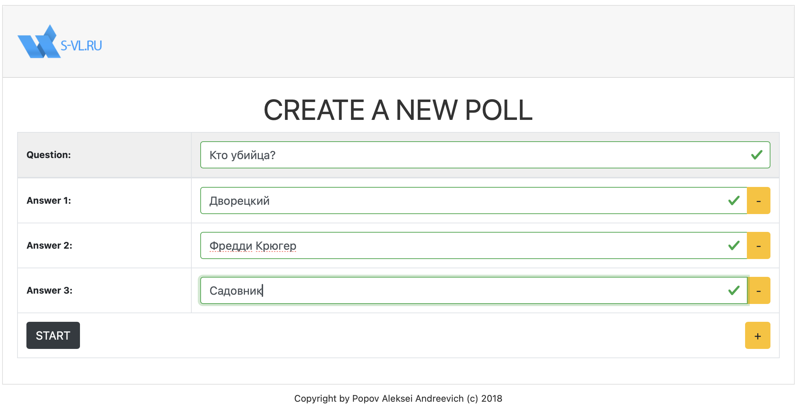
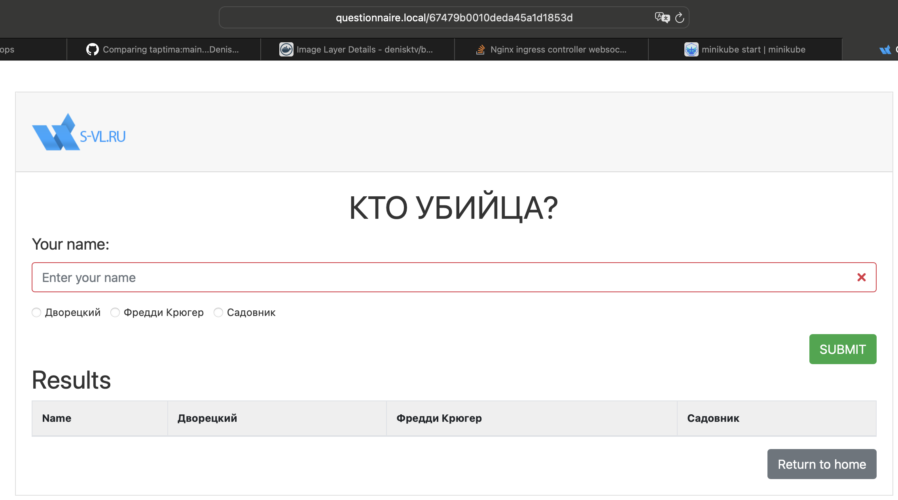
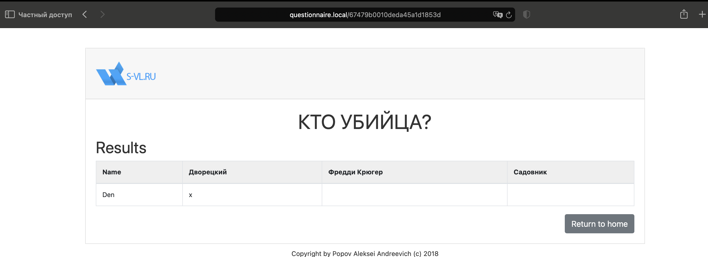
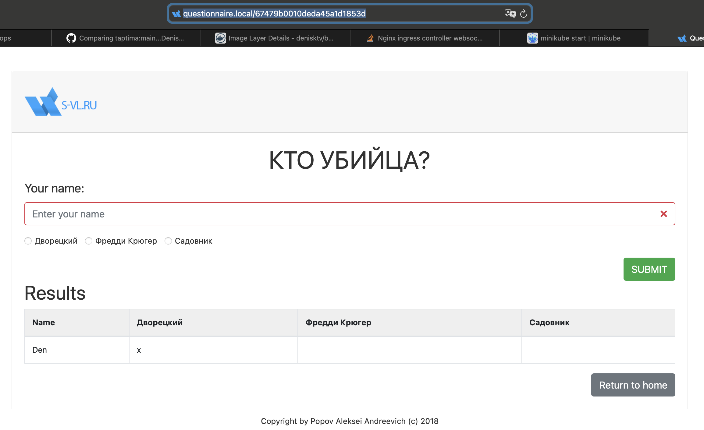
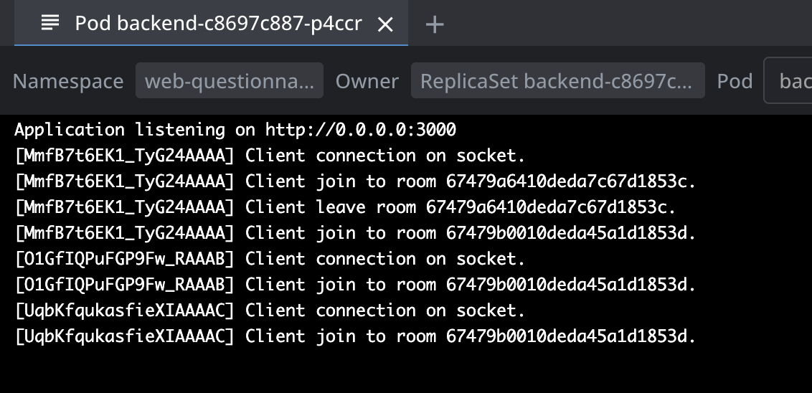

# DevOps Test: Приложение для анкетирования

Этот репозиторий содержит все необходимые файлы и инструкции для развертывания **Questionnaire Application** в Kubernetes-кластере на базе **Minikube**. Приложение состоит из двух сервисов: фронтенда (SPA) и бэкенда (API), а также MongoDB для хранения данных.

## Содержание
1. [Описание](#описание)
2. [Инструкция по запуску](#инструкция-по-запуску)
    - [1. Установка Minikube](#1-установка-minikube)
    - [2. Настройка NGINX Ingress Controller](#2-настройка-nginx-ingress-controller)
    - [3. Настройка hosts файла](#3-настройка-hosts-файла)
    - [4. Применение манифестов](#4-применение-манифестов)
3. [Docker-образы](#docker-образы)
4. [Проверка работы](#проверка-работы)

---

## Описание

**Questionnaire Application** представляет собой веб-приложение, предназначенное для создания и управления опросами. Состав:
- **Frontend (SPA)**
- **Backend (API)**
- **MongoDB**

---

## Инструкция по запуску

### 1. Установка Minikube

Установите Minikube, следуя [официальной инструкции](https://minikube.sigs.k8s.io/docs/start/).

Запустите Minikube:
```bash
minikube start
```

### 2. Настройка NGINX Ingress Controller

Включите NGINX Ingress Controller:
```bash
minikube addons enable ingress
```

### 3. Настройка hosts файла

Добавьте в /etc/hosts следующую строку, чтобы обращаться к приложению по домену:
```bash
127.0.0.1 questionnaire.local
```

### 4. Применение манифестов

Перейдите в папку k8s-manifests и примените манифесты в указанном порядке:
```bash
kubectl apply -f 00-namespace.yaml
kubectl apply -f 01-mongo-service.yaml
kubectl apply -f 02-backend-questionnaire.yaml
kubectl apply -f 03-frontend-questionnaire.yaml
kubectl apply -f 04-ingress.yaml
```

---

## Docker-образы

Список Docker-образов, использованных для запуска приложения:

Backend: 
- образ denisktv/backend-questionnaire:v0.0.2
- ссылка https://hub.docker.com/repository/docker/denisktv/backend-questionnaire

Frontend: 
- образ denisktv/frontend-questionnaire:v0.0.1
- ссылка https://hub.docker.com/repository/docker/denisktv/frontend-questionnaire

В папках questionnaire-backend и questionnaire-frontend есть Dockerfile и данными командами можно собрать свои образы:
```bash
docker build -t <имя_образа>:<тег>  .

docker push <имя_образа>:<тег> 
```

Заменить образы в соответствующих манифестах!

---

## Проверка работы

Для коректной работы Ingress в Minikube необхадимо выполнить:
```bash
minikube tunnel
```

Открываем браузер и переходим на http://questionnaire.local/

#### Создание опроса


#### Участие в опросе


Для коректной проверки, копируем ссылку и переходим в режим инкогнито

#### Голосуем


#### Результаты опроса


И в логах пода бэкенда мы видим работу WebSocet

#### Подключение WebSocket


---